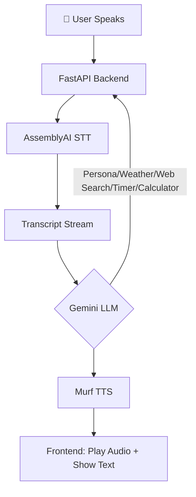

-----

# DIVA: Your Real-Time Conversational AI Mage 🔮✨

Welcome, adventurer\! Meet **DIVA** (Dhruv's Intelligent Voice Assistant), your powerful and friendly mage companion. DIVA listens, responds with warmth, and chats in real-time—all within your browser. She's here to assist you on your quests for knowledge and productivity with a sprinkle of magic\!

This project is built on a cutting-edge, streaming-first architecture, allowing for a truly seamless and natural voice-in, voice-out experience. You can even interrupt DIVA while she’s speaking, and she will gracefully stop to listen.

\<br/\>
\<p align="center"\>
\<em\>(Here is the perfect spot to add a GIF of your awesome UI in action\!)\</em\>
\</p\>
\<p align="center"\>
\
\</p\>
\<br/\>

## ✨ Features You'll Love

  * **🗣️ Full-Duplex & Barge-In:** Engage in fluid conversation and interrupt the AI at any point. DIVA will immediately stop speaking and start listening.
  * **⚡ Real-Time Streaming:** End-to-end WebSocket communication ensures minimal latency from your microphone to the AI and back to your speakers.
  * **🔮 Powerful Mage Spells (Tool Use):** DIVA can cast spells to help you with real-world tasks:
      * **🔮 Info Spell:** For real-time web searches and news, powered by **Tavily AI**.
      * **🧮 Rune of Calculation:** To solve any mathematical expression.
      * **⏳ Chronos Charm:** To set timers for your adventures.
      * **🌦️ Weather Whisper:** For live weather updates from across the realm.
  * **🧠 Intelligent & Context-Aware:** Leverages **Google's Gemini 1.5 Flash** for coherent, context-aware conversational abilities and intelligent tool selection.
  * **🔊 Streaming Text-to-Speech:** Generates high-quality, natural-sounding audio from **Murf.ai** and plays it back *as it's being generated*, for almost instant responses.
  * **⚙️ Smart & Secure Configuration:** A sleek settings sidebar allows you to use your own API keys, which are stored securely only in your browser's local storage.
  * **📜 Session Management:** Remembers your conversation history for contextual follow-up questions.
  * **🌐 Modern & Responsive UI:** A beautiful, responsive interface built with Tailwind CSS that looks great on both desktop and mobile.

## 🏗️ Architecture Overview

DIVA uses a streaming-first architecture built around WebSockets. This allows for low-latency, real-time communication between the client and the server, which is essential for a natural conversational flow.



**The real-time data flow is as follows:**

1.  **Client Connects:** The browser establishes a WebSocket connection and sends its stored API key configuration to the server.
2.  **Audio Streaming (Client → Server):** The user speaks, and the browser captures the audio, streaming it in chunks to the FastAPI backend.
3.  **Real-Time STT (Server → AssemblyAI):** The backend immediately forwards the audio stream to **AssemblyAI** for live transcription.
4.  **LLM & Tool-Use (Server ↔ Gemini):** The final transcript is sent to the **Google Gemini API**. The LLM analyzes the request, decides if a "spell" (tool) is needed, executes it, and formulates a response.
5.  **Streaming TTS (Server → Murf.ai):** The text response from Gemini is streamed to the **Murf.ai API** to be converted into audio chunks.
6.  **Audio Streaming (Server → Client):** The backend receives audio chunks from Murf.ai and sends them back to the frontend over the WebSocket *without waiting for the full audio to be generated*.
7.  **Live Playback & Interruption:** The browser plays the audio chunks as they arrive. If the user speaks again, the frontend stops playback and begins sending new audio, restarting the loop.

### Tech Stack

| Component                | Technology                                                                                                                                                                                                    |
| ------------------------ | ------------------------------------------------------------------------------------------------------------------------------------------------------------------------------------------------------------- |
| **Backend** | \ \ |
| **Real-Time Communication** | \                                                                                                                               |
| **Frontend** | \ \ \ |
| **Speech-to-Text (STT)** | \                                                                                                                                |
| **Large Language Model (LLM)** | \                                                                                                                            |
| **Text-to-Speech (TTS)** | \                                                                                                                                   |
| **Tools & APIs** | \ \                                                    |

## 📁 Project Structure

Here’s a look at the project's file structure, keeping everything neat and organized.

\<p align="center"\>
\
\</p\>

## 🛠️ Setup & Installation

Follow these steps to conjure DIVA on your local machine.

### Prerequisites

  * Python 3.8+
  * API Keys from:
      * [AssemblyAI](https://www.assemblyai.com/dashboard/signup)
      * [Google AI Studio (for Gemini)](https://aistudio.google.com/app/apikey)
      * [Murf.ai](https://murf.ai/)
      * [Tavily AI](https://tavily.com/) (Optional, for web search)
      * [WeatherAPI](https://www.weatherapi.com/) (Optional, for weather)

### 1\. Clone the Repository

```bash
git clone https://github.com/Dhruvmaniya7/voice-bot.git
cd "voice-bot/day 27"
```

### 2\. Create and Activate a Virtual Environment

  * **On macOS/Linux:**
    ```bash
    python3 -m venv venv
    source venv/bin/activate
    ```
  * **On Windows:**
    ```bash
    python -m venv venv
    .\venv\Scripts\activate
    ```

### 3\. Install Dependencies

Install all required Python packages using the `requirements.txt` file.

```bash
pip install -r requirements.txt
```

### 4\. Set Up Environment Variables

Create a file named `.env` in the `day 27` directory. This file will serve as a **fallback** if keys are not provided in the UI.

```env
# .env file

GEMINI_API_KEY="your_google_gemini_api_key_here"
ASSEMBLYAI_API_KEY="your_assemblyai_api_key_here"
MURF_API_KEY="your_murf_api_key_here"
WEATHER_API_KEY="your_weatherapi_key_here"
TAVILY_API_KEY="your_tavily_api_key_here"
```

## 🚀 Running the Application

1.  Start the FastAPI server using Uvicorn:

    ```bash
    uvicorn main:app --reload
    ```

    The `--reload` flag automatically restarts the server when you make changes to the code.

2.  Open your web browser and navigate to:

    **`http://127.0.0.1:8000`**

You should now see the DIVA interface, ready for a real-time conversation\!

### Deployment Note

If you deploy this application on a free-tier service (like Render, Heroku, etc.), please be aware that the app may "sleep" after a period of inactivity. The first request after it has slept might be slow as the server "wakes up." This is normal for free-tier deployments.
