-----

# DIVA: Your Real-Time Conversational AI Mage 🔮✨

Welcome, adventurer\! Meet **DIVA** (Dhruv's Intelligent Voice Assistant), your powerful and friendly mage companion. DIVA listens, responds with warmth, and chats in real-time—all within your browser. She's here to assist you on your quests for knowledge and productivity with a sprinkle of magic\!

This project is built on a cutting-edge, streaming-first architecture, allowing for a truly seamless and natural voice-in, voice-out experience. You can even interrupt DIVA while she’s speaking, and she will gracefully stop to listen.


## ✨ Features You'll Love

  * **🗣️ Full-Duplex & Barge-In:** Engage in fluid conversation and interrupt the AI at any point. DIVA will immediately stop speaking and start listening.
  * **⚡ Real-Time Streaming:** End-to-end WebSocket communication ensures minimal latency from your microphone to the AI and back to your speakers.
  * **🔮 Powerful Mage Spells (Tool Use):** DIVA can cast spells to help you with real-world tasks:
      * **🔮 Info Spell:** For real-time web searches and news, powered by **Tavily AI**.
      * **🧮 Rune of Calculation:** To solve any mathematical expression.
      * **⏳ Chronos Charm:** To set timers for your adventures.
      * **🌦️ Weather Whisper:** For live weather updates from across the realm.
  * **🧠 Intelligent & Context-Aware:** Leverages **Google's Gemini 1.5 Flash** for coherent, context-aware conversational abilities and intelligent tool selection.
  * **🔊 Streaming Text-to-Speech:** Generates high-quality, natural-sounding audio from **Murf.ai** and plays it back *as it's being generated*, for almost instant responses.
  * **⚙️ Smart & Secure Configuration:** A sleek settings sidebar allows you to use your own API keys, which are stored securely only in your browser's local storage.
  * **📜 Session Management:** Remembers your conversation history for contextual follow-up questions.
  * **🌐 Modern & Responsive UI:** A beautiful, responsive interface built with Tailwind CSS that looks great on both desktop and mobile.

## 🏗️ Architecture Overview

DIVA uses a streaming-first architecture built around WebSockets. This allows for low-latency, real-time communication between the client and the server, which is essential for a natural conversational flow.

```mermaid
flowchart TD
    A[🎤 User Speaks] --> B[FastAPI Backend];
    B --> C[AssemblyAI STT];
    C --> D[Transcript Stream];
    D --> E{Gemini LLM};
    E --> F[Murf TTS];
    F --> G[Frontend: Play Audio + Show Text];
    E -->|Persona/Weather/Web Search/Timer/Calculator| B;
```



**The real-time data flow is as follows:**

1.  **Client Connects:** The browser establishes a WebSocket connection and sends its stored API key configuration to the server.
2.  **Audio Streaming (Client → Server):** The user speaks, and the browser captures the audio, streaming it in chunks to the FastAPI backend.
3.  **Real-Time STT (Server → AssemblyAI):** The backend immediately forwards the audio stream to **AssemblyAI** for live transcription.
4.  **LLM & Tool-Use (Server ↔ Gemini):** The final transcript is sent to the **Google Gemini API**. The LLM analyzes the request, decides if a "spell" (tool) is needed, executes it, and formulates a response.
5.  **Streaming TTS (Server → Murf.ai):** The text response from Gemini is streamed to the **Murf.ai API** to be converted into audio chunks.
6.  **Audio Streaming (Server → Client):** The backend receives audio chunks from Murf.ai and sends them back to the frontend over the WebSocket *without waiting for the full audio to be generated*.
7.  **Live Playback & Interruption:** The browser plays the audio chunks as they arrive. If the user speaks again, the frontend stops playback and begins sending new audio, restarting the loop.

Of course\! Apologies for the confusion. Markdown code itself is text, but when viewed on a platform like GitHub, it renders those colorful badges that look like images.

Here is the raw Markdown code you can copy and paste directly into your `README.md` file. It will create the colorful, visually appealing tech stack table you're looking for, just like in the examples.

-----


### 🪄 Tech Stack

#### **Backend**
* Python
* FastAPI
* Uvicorn
* WebSockets

#### **Frontend**
* HTML5
* Tailwind CSS
* Vanilla JavaScript

#### **AI & External Services**
* **Google Gemini:** Large Language Model (LLM)
* **AssemblyAI:** Speech-to-Text (STT)
* **Murf.ai:** Text-to-Speech (TTS)
* **Tavily AI:** Web Search Tool
* **WeatherAPI:** Live Weather Data

## 📁 Project Structure

Here’s a look at the project's file structure, keeping everything neat and organized.


## 🛠️ Setup & Installation

Follow these steps to conjure DIVA on your local machine.

### Prerequisites

  * Python 3.8+
  * API Keys from:
      * [AssemblyAI](https://www.assemblyai.com/dashboard/signup)
      * [Google AI Studio (for Gemini)](https://aistudio.google.com/app/apikey)
      * [Murf.ai](https://murf.ai/)
      * [Tavily AI](https://tavily.com/) (Optional, for web search)
      * [WeatherAPI](https://www.weatherapi.com/) (Optional, for weather)

### 1\. Clone the Repository

```bash
git clone https://github.com/Dhruvmaniya7/voice-bot.git
cd "voice-bot/day 27"
```

### 2\. Create and Activate a Virtual Environment

  * **On macOS/Linux:**
    ```bash
    python3 -m venv venv
    source venv/bin/activate
    ```
  * **On Windows:**
    ```bash
    python -m venv venv
    .\venv\Scripts\activate
    ```

### 3\. Install Dependencies

Install all required Python packages using the `requirements.txt` file.

```bash
pip install -r requirements.txt
```

### 4\. Set Up Environment Variables

Create a file named `.env` in the `day 27` directory. This file will serve as a **fallback** if keys are not provided in the UI.

```env
# .env file

GEMINI_API_KEY="your_google_gemini_api_key_here"
ASSEMBLYAI_API_KEY="your_assemblyai_api_key_here"
MURF_API_KEY="your_murf_api_key_here"
WEATHER_API_KEY="your_weatherapi_key_here"
TAVILY_API_KEY="your_tavily_api_key_here"
```

## 🚀 Running the Application

1.  Start the FastAPI server using Uvicorn:

    ```bash
    uvicorn main:app --reload
    ```

    The `--reload` flag automatically restarts the server when you make changes to the code.

2.  Open your web browser and navigate to:

    **`http://127.0.0.1:8000`**

You should now see the DIVA interface, ready for a real-time conversation\!
